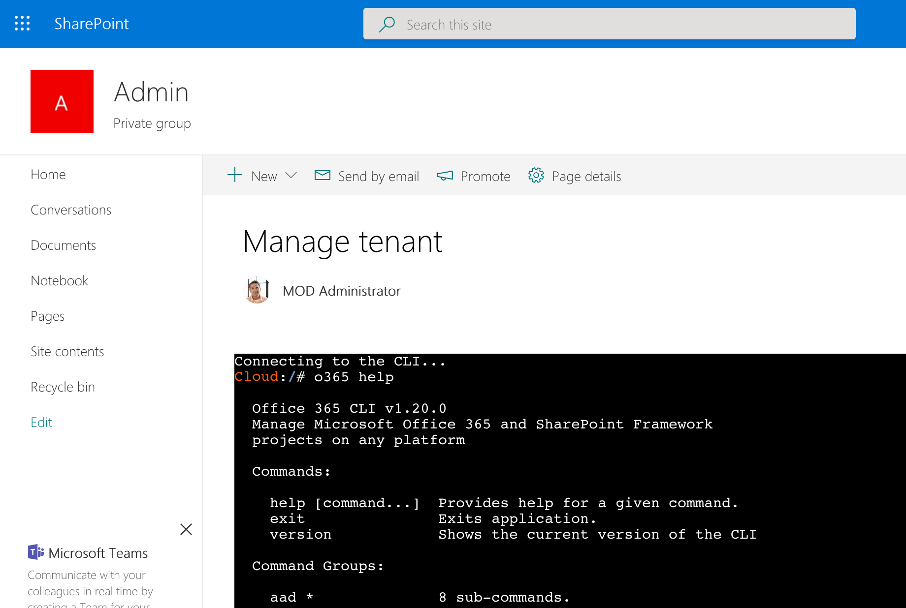

# Manage your tenant from a web part

Manage your Office 365 tenant using the [Office 365 CLI](https://aka.ms/o365cli) in a SharePoint Framework web part.

## Prerequisites

- Azure subscription
- Office 365 tenant with SharePoint app catalog
- admin permissions in Azure
- admin permissions in Office 365
- Docker installed locally
- Node with npm and gulp installed locally

## Setup instructions

This solution consists of two pieces: a Docker image and a SharePoint Framework solution. It assumes that the Docker container is running on [Azure Container Instances](https://azure.microsoft.com/services/container-instances/?WT.mc_id=m365-0000-wmastyka).

1. Clone this repo

### Docker

1. In your Azure subscription, create a new Azure Container Registry
   - enable the admin account
   - for testing, the Basic SKU will suffice
1. Build the Docker image
   - ensure that Docker is running on your machine
   - change directory to `Docker`
   - in the command line execute `docker build -t yourregistry.azureacr.io/office365-cli .`
1. Push the Docker image to your registry
   - login to your registry by executing in the command line `docker login yourregistry.azureacr.io`
   - push the image to registry by executing `docker push yourregistry.azureacr.io/office365-cli`
1. Start the container
   - in your Azure subscription create new Azure Container Instances (not its name for later)
   - change the registry type to _Private_
   - specify the name of your registry, its credentials and the name of the Docker image
   - in the network settings, disable the 80 port

### SharePoint Framework solution

1. Build the project
   - change the directory to SPFx
   - restore dependencies by executing `npm i`
   - build the project by executing `gulp bundle --ship`
   - package the project by executing `gulp package-solution --ship`
1. Deploy the solution package
   - in the web browser navigate to your SharePoint app catalog
   - deploy the package
   - click on the link to review the API permission requests
   - approve the permission request to Windows Azure Service Management API
   - navigate to the page where you want to place the web part
   - add the web part to the page
   - in its properties, specify:
     - the ID of your Azure subscription,
     - the name of the Resource Group where you created Azure Container Instances,
     - the name of your Azure Container Group (the name you used when creating Azure Container Instances)
   - the name of the container (if you followed this guide, it's _office365-cli_)
1. Use the Office 365 CLI
   - if the configuration process went well, you should now see a command prompt
   - you can start using the Office 365 CLI the same way you would do on your local machine

## Considerations

Following are some considerations that you should take into account before deploying and using the solution in your tenant.

- API permissions are granted to your whole tenant. If you want to increase the security of your tenant, change the solution to use isolated permissions in the _package-solution.json_ file
- you should configure permissions on your Azure Container Instances to control who can access the container with the Office 365 CLI. If you're an admin and login to Office 365 in the CLI, anyone could leverage your connection and control settings of your tenant
- if you no longer use the solution, stop the Azure Container Instance to avoid unnecessary costs. Don't forget to start it before using it again
- before stopping the Azure Container Instance, don't forget to log out in the Office 365 CLI. If you setup permissions on ACI correctly, staying logged in shouldn't do any harm, but you can log out as an extra precaution
- configure permissions on the page where the web part is placed to avoid unauthorized access
- if you want to share this solution with your colleagues, you should provision a dedicated Azure Container Instance for them with correctly configured permissions to avoid collisions and using each other's credentials to manage Office 365

## Room for improvement

To make the solution easier to use, it could use the following improvements:

- use isolated permissions to improve security in SharePoint
- use dedicated Resource Group with permissions granted to people who should be allowed to use this solution
- automatically:
  - deploy Azure Container Instance each time the web part with the terminal is opened
  - connect the web part to the newly created ACI
  - delete the ACI when the web part is no longer used
  - delete the ACI and close the connection on inactivity
- when creating ACI, automatically set permissions so that it can be used only by the current user
